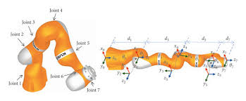

# KUKA iiwa Robot Arm Teleoperation via Computer Vision

A real-time teleoperation system that enables controlling a KUKA LBR iiwa robot arm in PyBullet using computer vision and human pose estimation. This implementation focuses on mapping human left arm movements to the robot's joints.

## 🚀 Features

- **Real-time Pose Estimation**: Uses MediaPipe for accurate human pose detection
- **KUKA iiwa Integration**: Specifically designed for KUKA LBR iiwa robot arm
- **Left Arm Control**: Maps human left arm movements to the robot's joints
- **Modular Architecture**: Separated into vision, control, and simulation modules
- **Smooth Motion Control**: Implements joint trajectory generation with smoothing
- **Physics Simulation**: Leverages PyBullet for realistic physics and environment interaction
- **Feedback Control**: Maintains stability through continuous error correction

## 🤖 KUKA iiwa Joint Mapping

The system maps human left arm movements to the KUKA iiwa's joints as follows:



1. **Joint 1 (Base Rotation)**: Shoulder yaw movement
2. **Joint 2 (Shoulder Pitch)**: Shoulder up/down movement
3. **Joint 3 (Shoulder Roll)**: Shoulder rotation
4. **Joint 4 (Elbow)**: Elbow flexion/extension
5. **Joint 5 (Wrist Roll)**: Wrist rotation
6. **Joint 6 (Wrist Pitch)**: Wrist up/down movement
7. **Joint 7 (Wrist Yaw)**: Wrist rotation (not currently mapped)

> **Note**: The current implementation focuses on the left arm control with joints 1-6. The mapping is designed to be intuitive, with the robot mirroring the human's left arm movements.

## 📦 Installation

1. Clone the repository:
   ```bash
   git clone https://github.com/BouajilaHamza/Pybullet-Optical-Robot-Mimic.git
   cd Pybullet-Optical-Robot-Mimic
   ```

2. Create and activate a virtual environment (recommended):
   ```bash
   uv venv
   source venv/bin/activate  # On Windows use `venv\Scripts\activate`
   ```

3. Install the required packages:
   ```bash
   uv sync
   ```

## 🛠 Project Structure

```
src/
├── modules/
│   ├── vision_module.py     # Camera capture and pose estimation
│   ├── control_module.py    # Joint trajectory generation and control
│   └── simulation_module.py # PyBullet simulation environment
├── models/                  # Humanoid URDF models
└── utils/                   # Utility functions and helpers
```

## 🚀 Quick Start

1. Ensure your webcam is connected and accessible
2. Run the main teleoperation script:
   ```bash
   python src/main.py
   ```
3. Position yourself in front of the camera
4. The humanoid in the simulation should now mimic your movements

## 🎯 Key Components

### Vision Module
- Captures and processes camera frames
- Performs pose estimation using MediaPipe
- Extracts keypoints for human pose

### Control Module
- Maps human poses to robot joint commands
- Implements smoothing for natural movements
- Includes balance and collision avoidance

### Simulation Module
- Manages the PyBullet physics simulation
- Handles robot model loading and control
- Provides visualization and debugging tools

## 📊 Performance Metrics

- **Latency**: Measures the end-to-end delay in the control loop
- **Accuracy**: Tracks joint angle errors between target and actual poses
- **Stability**: Monitors balance and collision occurrences

## 🤝 Contributing

Contributions are welcome! Please feel free to submit a Pull Request.

## 📄 License

This project is licensed under the MIT License - see the [LICENSE](LICENSE) file for details.

## 📚 Resources

- [PyBullet Documentation](https://docs.google.com/document/d/10sXEhzFRSnvFcl3XxNGhnD4N2SedqwdAvK3dsihxVUA/)
- [MediaPipe Pose](https://google.github.io/mediapipe/solutions/pose.html)
- [URDF Documentation](http://wiki.ros.org/urdf)